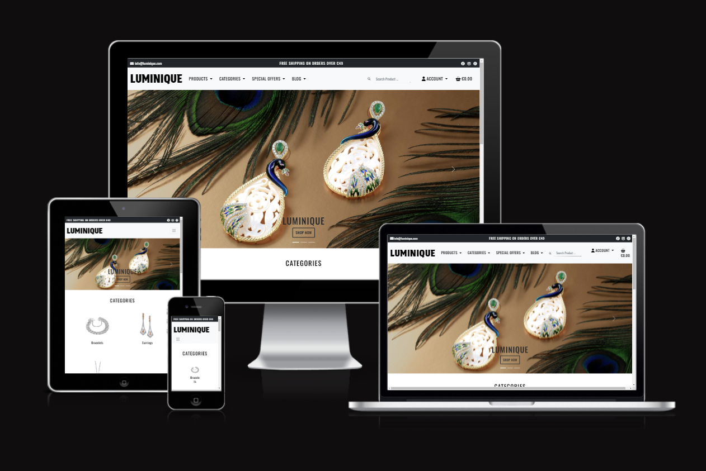
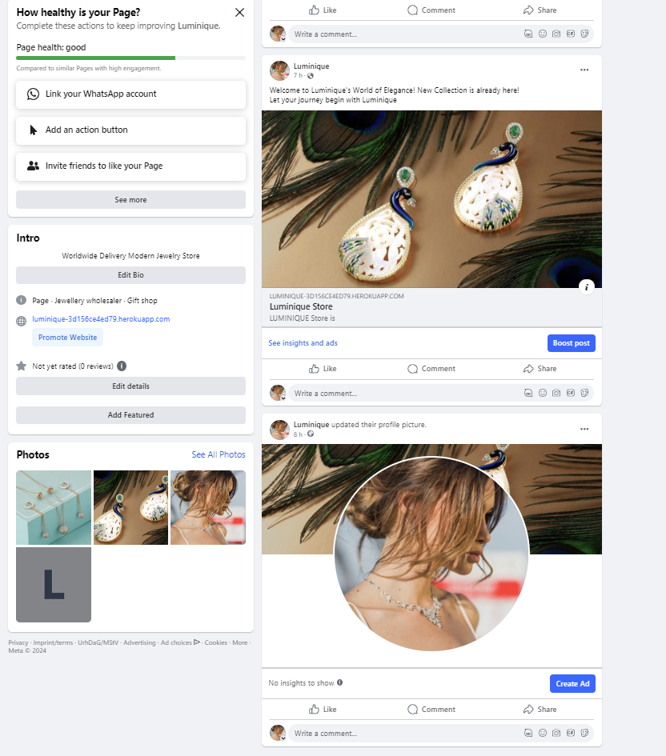
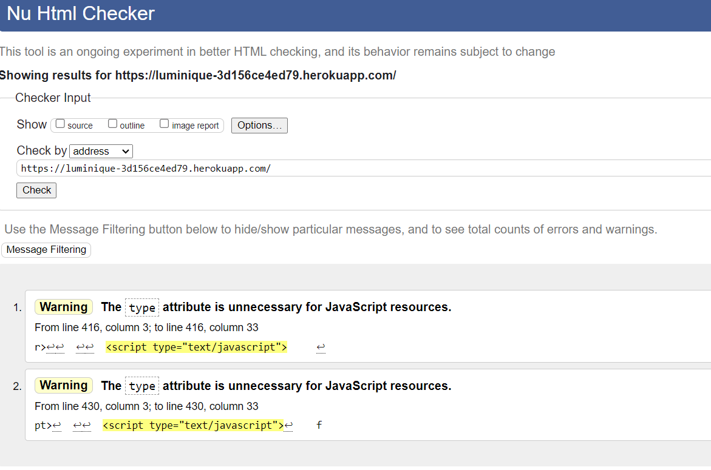
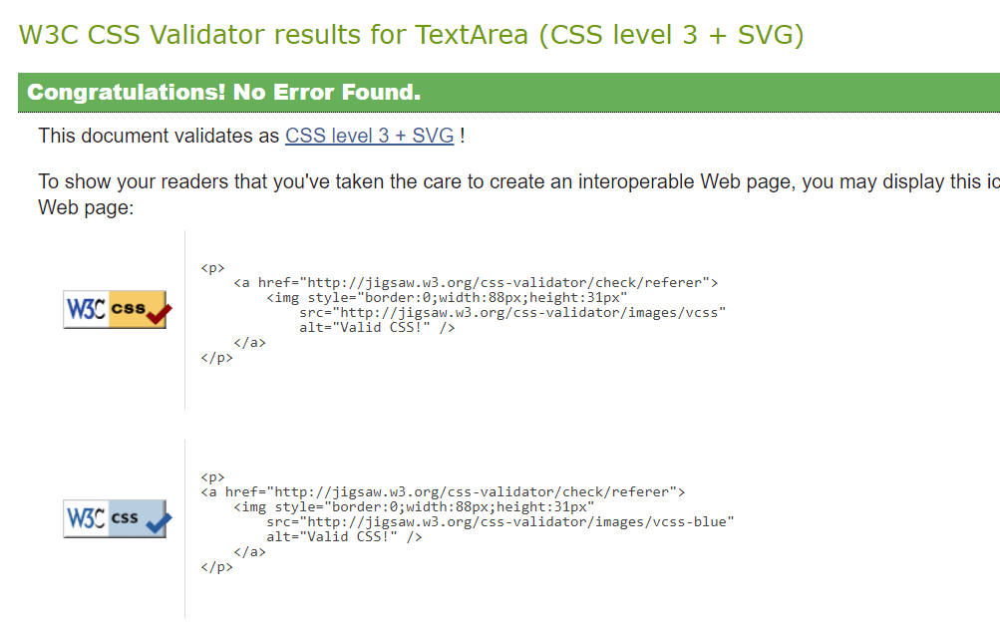

# **Luminique**

**Developer: Ksenia Sossin**
* [View Sweet Code Blog Repository](https://github.com/KseniaSOS/luminique_store)
* [View live website](https://luminique-3d156ce4ed79.herokuapp.com/)

# Table of Content

* [**Project**](<#project>)
    * [Introduction](<#introduction>)
    * [Site Users Goal](<#site-users-goal>)
    * [Business Goal](<#business-goal>)    
    * [Marketing](<#marketing>)
      * [Business Model](<#business-model>)
      * [Marketing Strategy](<#marketing-strategy>)        
    * [Project Management](<#project-management>)

* [**User Experience (UX)**](<#user-experience-ux>)
    * [Wireframes](<#wireframes>)
    * [User Stories](<#user-stories>)
    * [Site Structure](<#site-structure>)
    * [Design Choices](<#design-choices>)

* [**Existing Features**](<#existing-features>)    
    * [Navigation](<#navigation>)
    * [Home](<#home>)
    * [Products](<#hero-image>)
    * [Product Detail View](<#product-detail-view>)
    * [Review](<#review>)
    * [Blog](<#blog>)
    * [Post Detail View](<#post-detail-view>)
    * [Wishlist](<#Wishlist>)    
    * [Shopping Bag](<#shopping-bag>)
    * [Secure Checkout](<#secure-checkout>)
    * [Order Confirmation](<#order-confirmation>)
    * [Confirmation Emails](<#confirmation-emails>)
    * [Admin Area](<#admin-area>) 
    * [Product Menagemant](<#product-menagement>)        
    * [Blog Menagement](<#blog-menagement>)
    * [Sign Up](<#sign-up>)
    * [Sign In](<#sign-in>)
    * [Sign Out](<#sign-out>)
    * [Footer](<#footer>)
    * [Flash Messages](<#flash-messages-and-confirmation-pages-to-the-user>)

* [**Features Left To Implement**](<#features-left-to-implement>)

* [**Testing**](<#testing>)
    * [Manual Testing](<#manual-testing>)
    * [Code Validation](<#code-validation>)
    * [Additional Testing](<#additional-testing>)
    * [Known Bugs](<#known-bugs>)

* [**Technologies Used**](<#technologies-used>)
    * [Languages](<#languages>)
    * [Frameworks & Software](<#frameworks--software>)
    * [Libraries](<#libraries>)

* [**Deployment**](<#deployment>)
* [**Credits**](<#credits>)
* [Acknowledgements](<#acknowledgements>)

# **Project**

## Introduction

Introducing Luminique, your ultimate online destination for exquisite and stylish jewelry that caters to the fashion-forward woman. Jewelry crafted from the finest materials, including gold, silver, and sparkling zirconium stones. Designed to appeal to a broad age range from 16 to 60 years, Luminique ensures that every piece resonates with the personal style  of  customers. All products have information and responsive customer support. The site also offers a blog that is handled by Luminique Team with information about their latest releases and other relevant content for the site visitor. Luminique is committed to providing a seamless and secure online shopping experience. 

Project was created for Portfolio Project #5 (E-Commerce Applications Portfolio Project) - Diploma in Full Stack Software Development Diploma at the [Code Institute](https://www.codeinstitute.net).

* [View live website here](https://luminique-3d156ce4ed79.herokuapp.com/)
 

## Site Users Goal

Buyers love modern and stylish jewelry that easily suits their tastes and fashion preferences. The goal is to ensure that the site is easy to use. A visually appealing website that will allow customers to browse, search and purchase jewelry easily. Buyers expect quality jewelry made from real gold, silver and semi-precious stones. They want to make sure they are getting good value for money. Therefore, detailed product descriptions are desired, including materials used, sizes, care instructions, and reviews to help customers make an informed purchasing decision. Customers expect responsive support to answer questions, resolve problems, and promptly help resolve any issues. The buyer is provided with secure online transactions and protection of confidential financial information of clients.

## Business Goal

The main business goal of online jewelry store is to increase sales of contemporary jewelry. The site owner can provide an intuitive and secure site, ensuring a smooth shopping experience and effective product presentation.
To increase new customers and retain existing customers, various marketing strategies are implemented to encourage repeat purchases and increase customer loyalty through loyalty programs.

To check whether these goals are being achieved, site owner can use various measurement and analysis tools, such as:
- Sales revenue and conversion rate
- Website traffic and user engagement analytics (Google Business, Google Ads, Google Analytics)
- Customer satisfaction surveys and feedback
- Monitoring product returns and customer complaints
- Regular technical testing of the site to eliminate potential problems
- Constant monitoring of SEO metrics

Regular review and analysis of these indicators will help evaluate the effectiveness of all strategies and make the necessary adjustments to achieve the goals of the business and customers of the online jewelry store.

[Back to top](<#table-of-content>)

## Marketing
### Business Model

The business model is focused on selling jewelry to individuals and involves a single payment, making our business model a B2C (Business to Consumer) model. This approach allows us to engage directly with our customers and provide them with a seamless shopping experience. The website is highly adjustable to adapt to customer needs, and effective marketing techniques are essential to reaching and engaging our audience.

### Marketing Strategy

#### Optimize For Mobile Devices.

In a mobile-centric world, our website is fully responsive to ensure an excellent user experience on both mobile and desktop devices. We prioritize mobile accessibility to reach a wider audience.

#### Website Layout.

Our website boasts an intuitive and easy-to-navigate design, making it effortless for customers to find relevant information and make purchases without any hassle. User experience is at the core of our design principles.

#### Marketing Techniques

When it comes to marketing jewelry business, it's essential to choose the right marketing types that align with our target market and goals.

There are 4 key marketing types that can benefit your jewelry business:
* Content Marketing
* Social Media Marketing
* SEO (Search Engine Optimization)
* Email Marketing

**Content Marketing**

Content marketing involves creating valuable and engaging content to attract and convert target customers, building trust and loyalty. It requires consistency and organization but can effectively demonstrate expertise and attract relevant clients. 
Luminique maintains a blog on the website, where there is  original, informative, and relevant content for customers. The aim is to make customers want to visit the web site because they genuinely find it valuable.

**Social Media Marketing** 

Luminique Shop maintains an active presence on social media platforms, including Facebook and Instagram. These platforms help us engage with both existing and potential customers. We use them to create engagement, interact broadly, and maintain brand recognition. Our social media channels also serve as a means to drive traffic to our website, especially when we publish new blogs or feature the product of the month. Currently, our focus is on organic growth, but we may explore paid ads targeting specific customer groups in the future.

- Instagram/Facebook: Using visually appealing images and videos (shorts/reels) to showcase their beauty and elegance. The visual nature of Instagram is perfect for showcasing jewelry. To increase visibility, it is also worth using hashtags.

- Pinterest is a popular platform for discovering new trends and products, making it an ideal platform for our target audience. We need to create boards that feature jewelry collections, styling tips, and fashion ideas.

- Influencer Partnerships: Collaboration with influencers or micro-influencers who resonate with our target audience. They can create authentic content featuring Luminique jewelry, reaching their followers and potentially driving traffic and sales to our online store.

**Email Marketing**

Email marketing is highlighted as beneficial for almost all e-commerce businesses, offering advantages such as scalability, permission-based contact lists. Luminique offers site users the option to sign up for our newsletter, powered by Mailchimp. This newsletter keeps customers informed about the latest developments at Luminique Online Shop, including new blog posts, the product of the month, events, collaborations, and discount codes.

**Search Engine Optimization (SEO)**

SEO is critical to improving search engine rankings and user experience. Luminique is focusing on leveraging semantic HTML elements, keywords, and metadata to improve visibility on search engines. Using Wordtracker, a search was made for keywords that match the users' search criteria. 

*Meta Description*: LUMINIQUE is an online jewelry shop. Modern Jewelry crafted from silver and gold, adorned with cubic zirconia. Enjoy the convenience of global delivery on our handcrafted silver and gold pieces.

*Meta Keywords*: luminique, jewelry, bracelets, earrings, necklaces, gold-plated, silver, cubic zirconia, gifts, e-shop, online-shop, jewelry store, jewelry blog, email-newsletter, global delivery.

The website incorporates essential components like a sitemap.xml and robots.txt to facilitate search engine indexing and crawling. These files ensure that search engines can easily locate and access the site's pages, enhancing its visibility and search engine optimization (SEO) performance.

<b>Facebook Page</b>

 

[Back to top](<#table-of-content>)

## Project Management
### Github Board

I've been using the [project board](https://github.com/users/KseniaSOS/projects/7/views/1) in GitHub to keep my project together. It has been working really well and has helped me structure up my work a lot. GitHub was used to plan and organize my hole project and user stories.

<b>Github Board</b>

 

[Back to top](<#table-of-content>)

### Database Schema

I used the SmartDraw modelling tool to create the database schema. it shows the relationships between the different models in the database connected to the application.

Models used (besides standard user model) in this project are:

**App: Blog**
* **PostCategory** - Designed to manage blog categories.
* **Post** - Manages blog posts, linking them to their categories through a ForeignKey to the `PostCategory` model for proper categorization.

**App: Checkout**
* **Order** -  Responsible for managing customer orders, including storing delivery information, generating order numbers, and updating totals. It's linked to the user_profile model through a foreign key.
* **OrderLineItem** - Keeps track of each order item in each order the customer with ForeignKeys to the Order and Product model.

**App: Products**
* **Category** - Handles product categories.
* **Product** - This model is tasked with managing the details of products, such as price, name, and category. It includes a ManyToMany connection to the User model to facilitate tracking of products in users' wishlists.
* **Review** - This model manages product reviews, allowing users to leave feedback on products they have purchased or used.

**App: Profiles**
* **UserProfile** - This model maintains user-related information, including delivery details and order history. It features a method to either create a new user profile or update an existing one, ensuring that user information is current and accurate.

<b>Database Schema</b>

 

[Back to top](<#table-of-content>)

# Technologies Used
## Languages

* [Python](https://en.wikipedia.org/wiki/Python_(programming_language)) - Provides the functionality for the site.
* [HTML5](https://en.wikipedia.org/wiki/HTML) - Provides the content and structure for the website.
* [CSS](https://en.wikipedia.org/wiki/CSS) - Provides the styling for the website.
* [JavaScript](https://en.wikipedia.org/wiki/JavaScript) - Provides interactive elements of the website.

## Frameworks & Software

* [Bootstrap](https://getbootstrap.com/) - A CSS framework that helps building solid, responsive, mobile-first sites
* [Django](https://www.djangoproject.com/) - A model-view-template framework used to create the site
* [Balsamiq](https://balsamiq.com/) - Used to create the wireframe
* [Github](https://github.com/) - Used to host and edit the website
* [GitBash](https://en.wikipedia.org/wiki/Bash_(Unix_shell)) - Terminal in [Gitpod](https://www.gitpod.io) used to push changes to the GitHub repository
* [Heroku](https://en.wikipedia.org/wiki/Heroku) - A cloud platform that the application is deployed to
* [ElephantSQL](https://www.elephantsql.com/) - Provides a browser tool for SQL queries
* [Lighthouse](https://developer.chrome.com/docs/lighthouse/overview/) - Used to test performance of site
* [Google Chrome DevTools](https://developer.chrome.com/docs/devtools/) - Used to debug and test responsiveness
* [HTML Validation](https://validator.w3.org/) - Used to validate HTML code
* [CSS Validation](https://jigsaw.w3.org/css-validator/) - Used to validate CSS code
* [JSHint Validation](https://jshint.com/) - Used to validate JavaScript code
* [PEP8 Validation](https://pep8ci.herokuapp.com/) - Used to validate Python code
* [SmartDraw](https://app.smartdraw.com/) - Used for creating the Model Schema
* [Font Awesome](https://fontawesome.com/) - Used for icon features on the site
* [Google Fonts](https://fonts.google.com/) - used to import fonts for the website
* [Tynypng](https://tinypng.com/) - Used for compressing all images
* [Am I Responsive?](https://ui.dev/amiresponsive) - Used for createing responsive deisign image
* [Favicon](https://favicon.io/) - Used to create the favicon
* [Mailchimp](https://mailchimp.com/) - Used for the newsletter functionality on the site
* [Amazon Web Services](https://aws.amazon.com/) - A service that hosts all static files and images in the project

## Libraries

* [asgiref](https://pypi.org/project/asgiref/) - ASGI is a standard for Python asynchronous web apps and servers to communicate with each other, and positioned as an asynchronous successor to WSGI.
* [cryptography-3.4.8](https://pypi.org/project/cryptography/3.4/) - Cryptography is a package which provides cryptographic recipes and primitives to Python developers.
* [Django](https://pypi.org/project/Django/) - Django is a high-level Python web framework that encourages rapid development and clean, pragmatic design.
* [django-allauth](https://pypi.org/project/django-allauth/) - Integrated set of Django applications addressing authentication, registration, account management as well as 3rd party (social) account authentication.
* [django-crispy-forms](https://pypi.org/project/django-crispy-forms/) - Used to integrate Django DRY forms in the project.
* [gunicorn](https://pypi.org/project/gunicorn/) - Gunicorn ‘Green Unicorn’ is a Python WSGI HTTP Server for UNIX. It’s a pre-fork worker model ported from Ruby’s Unicorn project. The Gunicorn server is broadly compatible with various web frameworks, simply implemented, light on server resource usage, and fairly speedy.
* [oauthlib](https://pypi.org/project/oauthlib/) - OAuthLib is a framework which implements the logic of OAuth1 or OAuth2 without assuming a specific HTTP request object or web framework.
* [Pillow](https://pypi.org/project/Pillow/) - The Python Imaging Library adds image processing capabilities to your Python interpreter.
* [psycopg2](https://pypi.org/project/psycopg2/) - Psycopg is the most popular PostgreSQL database adapter for the Python programming language.
* [PyJWT](https://pypi.org/project/PyJWT/) - A Python implementation of RFC 7519.
* [python3-openid](https://pypi.org/project/python3-openid/) - OpenID support for modern servers and consumers.
* [pytz](https://pypi.org/project/pytz/) - This is a set of Python packages to support use of the OpenID decentralized identity system in your application, update to Python 3
* [requests-oauhlib](https://pypi.org/project/requests-oauthlib/) - P    rovides first-class OAuth library support for Requests.
* [sqlparse](https://pypi.org/project/sqlparse/) - sqlparse is a non-validating SQL parser for Python. It provides support for parsing, splitting and formatting SQL statements.
* [stripe](https://pypi.org/project/stripe/) - A Python library for Stripe’s API.

[Back to top](<#table-of-content>)

# Testing
## Manual Testing
BDD, or Behaviour Driven Development, is the process used to test user stories in a non-technical way, allowing anyone to test the features of an app.

[Back to top](<#table-of-content>)

## Code Validation
### Markup Validation

The website Luminique was validated by [W3C html Validator](https://validator.w3.org/). There were some errors, which i described in bud section. But in general all pages were without errors, just with warnings about js.

<b>HTML Validation Result</b>

 

### CSS Validaton

The CSS have been run through the [W3C CSS Validator](https://jigsaw.w3.org/css-validator/), which reports no errors.

<b>CSS Validation Result</b>

 

### JavaScript Validation

[JSHint](https://jshint.com/) was used to validate the JavaScript of the website, which reports no errors.
 
* stripe_elements.js in checkout app - No errors reported
* inline jscript in bag.html in bag app - No errors reported
* inline jscript in products.html in products app - No errors reported
* inline jscript in base.html in root templates - No errors reported
* inline jscript in footer.html in root templates - No errors reported
* inline jscript in all_posts.html in blog app - No errors reported
* inline jscript in policy_privacy.html in home app - No errors reported

### PEP Validation
CI Python Linter [Code Institute Linter](https://pep8ci.herokuapp.com/) was used to validate the Python code in the project. Following files have been validated:

**App Bag**
* admin.py -  No errors reported
* apps.py -  No errors or warnings reported
* contexts.py -  No errors or warnings reported
* urls.py -  No errors or warnings reported
* views.py -  No errors or warnings reported
* bag_tools.py - No errors or warnings reported

**App Blog**
* admin.py - No errors reported
* apps.py - No errors reported
* forms.py - No errors reported
* models.py - No errors reported
* urls.py - No errors reported
* views.py - No errors reported

**App Checkout**
* __init__.py - No errors reported
* admin.py - No errors reported
* apps.py - No errors reported
* forms.py - No errors reported
* models.py - No errors reported
* signals.py - No errors reported
* urls.py - No errors reported
* views.py - No errors reported
* webhook_handler.py - 2 line-too-long errors reported

**App Home**
* apps.py - No errors reported
* urls.py - No errors reported
* views.py - No errors reported

**App Products**
* admin.py - No errors reported
* apps.py - No errors reported
* forms.py - No errors reported
* models.py - No errors reported
* urls.py - No errors reported
* views.py - No errors reported
* widgets.py - No errors reported

**App Profiles**
* apps.py - No errors reported
* forms.py - No errors reported
* models.py - No errors reported
* urls.py - No errors reported
* views.py - No errors reported

**luminque**
* urls.py - No errors reported
* views.py - No errors reported

**other**
* custom_storages.py - No errors reported

[Back to top](<#table-of-content>)

## Additional Testing

### Responsiveness Test

* The responsive design tests were carried out manually with [Google Chrome DevTools](https://developer.chrome.com/docs/devtools/) and [Responsive Design Checker](https://www.responsivedesignchecker.com/).

|        | Nexus 4 | Galaxy S5 | iPhone 3/4 | iPad Mini | iPad Pro | Display <1600px | Display >1600px |
|--------|---------|-----------|------------|-----------|----------|-----------------|-----------------|
| Render | pass    | pass      | pass       | pass      | pass     | pass            | pass            |
| Images | pass    | pass      | pass       | pass      | pass     | pass            | pass            |
| Links  | pass    | pass      | pass       | pass      | pass     | pass            | pass            |

Hover effect on blog categories is bigger than images. This can be seen just on big screens more then 1600x900.

<b>Responsive Design Checker</b>

 

### Browser Compatibility

* Google Chrome Version 
* Apple Safari 
* Microsoft Edge 

[Back to top](<#table-of-content>)

### Lighthouse

Google Lighthouse in Chrome Developer Tools was used to test the site within the areas of Performance, Accessibility, Best Practices and SEO. I tested the home page, view all blog posts page, view all products page, product management page and blog management page. 

<b>Lighthouse</b>

 

### WAVE

[WAVE](https://wave.webaim.org/) was used to check accessibility. There was an error in footer sections, which is described in bugs section.

<b>WAVE Result</b>

 

## Known bugs
### Fixed Bugs

* Dulicate ID on all_products page. 
  * Changed id to class and remaned.

    

<b>Html Validator</b>

    
    
    
 
  

### Unfixed Bugs

* Missing form label. 
  * This was a code from Mailchimp, so I didn't changed it to escape problems in the future.

    

<b>Wave Bug</b>

    
    
    
 
  